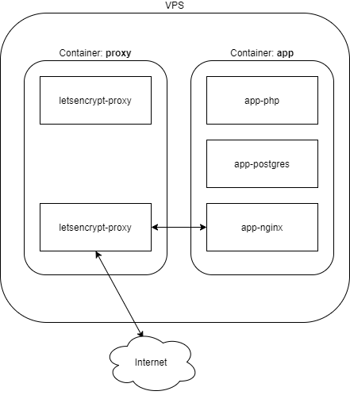

# Design decisions

This document contains information about how we chose to develop the application and why we did this.

## Tech Stack

The API and backend are built using PHP8. It uses Laravel as a framework, with PostgreSQL/MySql as the database, and it runs on nginx.

## Docker configuration


For the backend application we use two different `docker-compose` files.
The first one contains all needed images for the backend/api. The second is a simple Nginx reverse proxy that handles the incoming server traffic.

For the backend application we use two different docker-compose files. The first one contains all needed images for the
backend/api. The second is a simple Nginx reverse proxy that handles the incoming server traffic. The exact steps to
take, for getting the application to run using these dockers, you can checkout
the [local setup](local-setup.md).

### Nginx Reverse Proxy
The docker configuration for the proxy can be found in the `/proxy` folder.
For this container no specific build steps are required. It contains two images.

#### jwilder/nginx-proxy
This image handles the traffic rerouting. All traffic that arrives at port 80 and 443 passes through this image.
It also allows for SSL configuration as can be seen in the volumes that it uses.
The SSL setup and certificate installation/renewal is handled by [jrcs/letsencrypt-nginx-proxy-companion](https://hub.docker.com/r/jrcs/letsencrypt-nginx-proxy-companion/)

To map a domain name to a specific Docker you only have to include the following environment fields in the `docker-compose`
of the application that has to handle the traffic.
e.g:
```environment:
VIRTUAL_HOST: 'acc.mtl.wolfpackit.nl'
# Only needed if SSL should be configured
LETSENCRYPT_HOST: 'acc.mtl.wolfpackit.nl'
```
This piece of code is included in the backend docker-compose file from the project.
The rest is automatically handled by this docker image.

This piece of code is included in the backend docker-compose file from the MTL project. The rest is automatically
handled by this docker image.

Details and more options can be found at the [Github page](https://github.com/nginx-proxy/nginx-proxy)

#### jrcs/letsencrypt-nginx-proxy-companion
This image is responsible for dynamically obtaining the SSL certificate from LetsEncrypt.
Furthermore, it handles the SSL certificate renewal.

It requires two variables:

```
LETSENCRYPT_HOST: 'acc.mtl.wolfpackit.nl'
DEFAULT_EMAIL=dev-mtl@wolfpackit.nl
```

The default email is the address that will be notified on important news regarding this certificate.
This could be about an expiring certificate or security issues.

Details and more options can be found at
the [Github page](https://github.com/nginx-proxy/docker-letsencrypt-nginx-proxy-companion)

#### cron service
The cron service is build on a simple php:alpine image. This service copies a file called `crontab` to the container that calls the laravel scheduler each minute.
It enables the use of scheduled commands in laravel. 

See [local-daily](local-daily#Add-scheduled-command) for general usage

#### queue service
The queue service is build on a simple php:alpine image. The service calls the artisan command `queue:work`, which executes all commands that are put on the queue.
For more information on Queues and dispatching jobs see [here](https://laravel.com/docs/8.x/queues)

## Application

The application Docker is a bit more complex. It requires building steps to ensure the application is run smoothly.
Configuration files can be found in the `/app` folder. It consists of the following folders/files:

* `docker-configs/nginx/default.conf`, nginx configuration that handles incoming traffic and passes along to php-fpm.
* `docker-configs/php/php-fpm-entrypoint.sh`, script that is executed when the docker image is started. It handles
  deployment steps like composer install and migrations. Except for all necessary steps it also optimizes performance in
  case it is a production environment.
* `docker-configs/php/xdebug-local.ini`, configuration file that maps XDebug variables from the environment docker environment file to the XDebug configuration.
* `docker-compose.yml`, this file combines the different docker images into one container. It also configures how the
  images link to the host machine, using volumes, environment variables and exposed ports. The Docker-compose file
  consists of three different images.:
    * Nginx, handles traffic from the reverse proxy and passes it along to php-fpm according to the `nginx/default.conf`
      file.
    * Postgres, the DB that is used. The DB requires username, password and DB name. It stores its data using volumes.
      So the data is persisted on the host machine in folder `/db-data/`
    * PHP, the PHP-FPM that handles the incoming request and returns the views/data. This image is the most elaborate.
      Building this docker is done by following the `Dockerfile`. This file decides which PHP version is used, and which
      PHP extensions will be installed/enabled. Furthermore, it installs composer into the docker image, such that
      composer packages can be installed. The last step is to call the entry script `php/php-fpm-entrypoint.sh`. This
      script ensures that all migrations are executed, all composer package are installed and permissions of the laravel
      cache/storage is configured correctly. Finally it optimizes Laravels performance in case of a production build.
    * Node, the node docker is responsible for installing and compiling all npm dependencies. For local development, it keeps running and keeps watching for file changes.
      After changes are made, resources are automatically compiled/published.
      The production variant only compiles once.
    * [DEV ONLY] Mailhog catches all outbound emails and is displays them in a local UI on port 8025

## Building Docker images
If any change is made to either the docker-compose file, dockerfile or configuration files (`docker-configs folder`), the container needs to be rebuilt.
At the moment this has to be done manually, however in a later stage this can be automated using Gitlab CI / CD.

The Docker can be built using the following command:
* `cd app`
* `docker-compose --env-file ../src/.env build`
