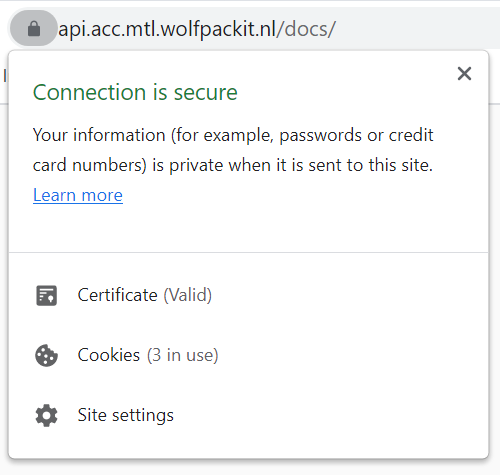
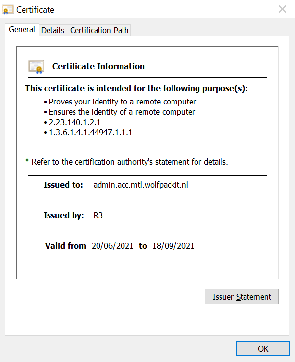

# Known Issues

While our developers have gone through great pains to ensure that the application is scalable, secure and maintainable,
the following issues may show up.

## Let's Encrypt certificate expiration notice

`jrcs/letsencrypt-nginx-proxy-companion` is used to renew the SSL certificates in time. Let's Encrypt requires such a
refresh every 90 days.

The validity of the certificate can be checked in the browser by visiting the URL in question and clicking on the
lock-icon.

After clicking "Certificate", a window shows with the end date.

If for whatever reason the Docker instance `jrcs/letsencrypt-nginx-proxy-companion` is not running, the certificate may
be in danger of expiring. This might happen after a server reboot and the Docker containers are not restarted. However,
this should also cause everything else in the application to not function.