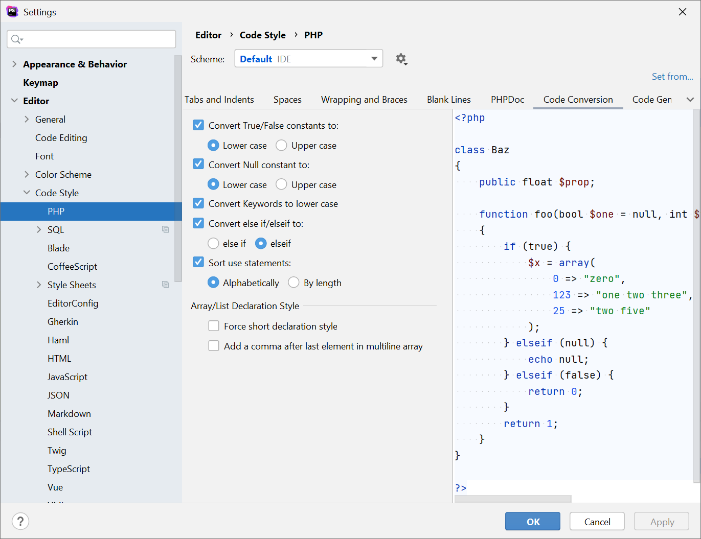

# Coding Standards

To help with standardization, the PHP Framework Interoperability Group (PHP-FIG) has drafted standards. Many packages
and frameworks already adhere to these. As a company, you have the freedom to choose between them. At Wolfpack, we opt
to use the following PSRs for any greenfield code that is not supplied by a vendor (i.e. composer packages do not need
to be reformatted/rewritten to adhere to a PSR).

All PHP code has to adhere to https://www.php-fig.org/psr/psr-12/ .

## Formatting

There is only one rule with regards to formatting:

> ⚠ **Warning:** ⚠
>
> Commits that change the **functionality** of the code should be made **separately** from commits that merely change the
**formatting** of it.

This makes reading pull requests much easier, because there is far less visual noise.

Reformatting a project is not a trivial task. There are automated tools that can do this, but they need to be applied
with care. Before doing this, ideally all open pull requests/branches should be closed, so that the number of merge
conflicts can be kept to a minimum.

The corollary of this rule is:

> ⚠ **Warning:** ⚠
>
> If you do not have full test coverage, refactoring **is** changing functionality.

Even with the best precautions, you may miss a case that would be covered by full test coverage.

## PHPStorm

In PHPStorm, go to File > Settings > Editor > Code Style > PHP. Choose "Set from…" and pick the appropriate standard.
The IDE should now show warnings if you're violating this standard.



This should also change any previously made settings.

## VSCode

> ⚠ **Warning:** ⚠
>
> Incomplete information ahead.

https://jamesauble.medium.com/vs-code-php-formatter-that-actually-works-mac-linux-62a307443d57 seems to have a promising
guide for this.

If you install the Prettier extension, add this to your settings.json file.

```
{
    "editor.defaultFormatter": "esbenp.prettier-vscode",
    "[javascript]": {
      "editor.defaultFormatter": "esbenp.prettier-vscode"
    },
    "[php]": {
      "editor.defaultFormatter": "esbenp.prettier-vscode"
    }
  }
```
