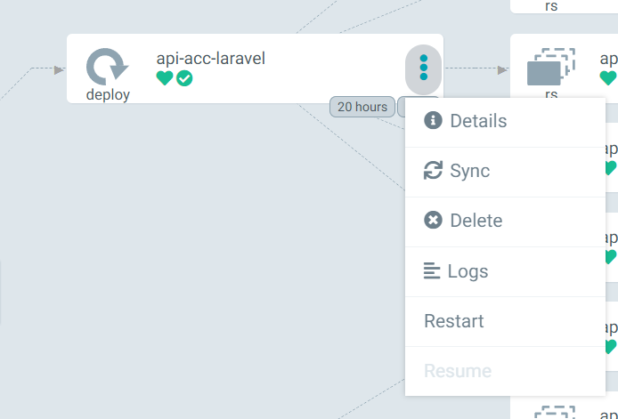

# Deploying on Acceptance

## How to deploy

At the moment, deployment on acceptance is fully automated. Merge your changes into the `main` branch, and they will
automatically propagate.

## Changes in the environment variables

When environment variables are added (for instance, API keys), the `api-acc-laravel` deployment must be restarted. This
deployment can be found here: #TODO set url to api-acc application in argocd 

Restarting can be done via the web interface:

Credentials to log in to ArgoCD can be found in Bitwarden.