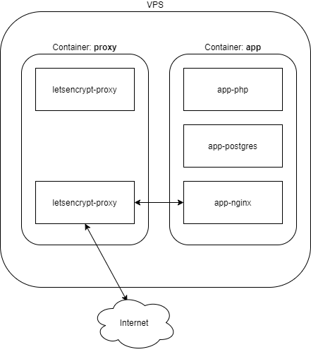

# Design decisions

This document contains information about how we chose to develop the application and why we did this.

## Tech Stack

The API and backend are built using PHP8. It uses Laravel 9 as a framework, with PostgreSQL as the database, and it runs
on nginx.

This is a known tech stack for smaller-scale projects that allows rapid development and deployment.

## Docker configuration



For the backend application we use two different `docker-compose` files. The first one contains all needed images for
the backend/api. The second is a simple Nginx reverse proxy that handles the incoming server traffic.

For the backend application we use two different docker-compose files. The first one contains all needed images for the
backend/api. The second is a simple Nginx reverse proxy that handles the incoming server traffic. The exact steps to
take, for getting the application to run using these dockers, you can checkout
the [local setup](../initialSetup/localSetup.md).

### Nginx Reverse Proxy

The docker configuration for the proxy can be found in the `/proxy` folder. For this container no specific build steps
are required. It contains two images.

#### jwilder/nginx-proxy

This image handles the traffic rerouting. All traffic that arrives at port 80 and 443 passes through this image. It also
allows for SSL configuration as can be seen in the volumes that it uses. The SSL setup and certificate
installation/renewal is handled
by [jrcs/letsencrypt-nginx-proxy-companion](https://hub.docker.com/r/jrcs/letsencrypt-nginx-proxy-companion/)

To map a domain name to a specific Docker you only have to include the following environment fields in
the `docker-compose`
of the application that has to handle the traffic. e.g:

```environment:
VIRTUAL_HOST: 'acc.{PROJECT_SLUG}.wolfpackit.nl'
# Only needed if SSL should be configured
LETSENCRYPT_HOST: 'acc.{PROJECT_SLUG}.wolfpackit.nl'
```

This piece of code is included in the backend docker-compose file from the project. The rest is automatically handled by
this docker image.

Details and more options can be found at the [Github page](https://github.com/nginx-proxy/nginx-proxy)

#### jrcs/letsencrypt-nginx-proxy-companion

This image is responsible for dynamically obtaining the SSL certificate from LetsEncrypt. Furthermore, it handles the
SSL certificate renewal.

It requires two variables:

```
LETSENCRYPT_HOST: 'acc.{PROJECT_SLUG}.wolfpackit.nl'
DEFAULT_EMAIL=dev-{PROJECT_SLUG}@wolfpackit.nl
```

The default email is the address that will be notified on important news regarding this certificate. This could be about
an expiring certificate or security issues.

Details and more options can be found at
the [Github page](https://github.com/nginx-proxy/docker-letsencrypt-nginx-proxy-companion)

## Building Docker images

If any change is made to either the docker-compose file, dockerfile or configuration files (`docker-configs folder`),
the container needs to be rebuilt. At the moment this has to be done manually, however in a later stage this can be
automated using Gitlab CI / CD.

The Docker can be built using the following command:

* `cd app`
* `docker-compose --env-file ../src/.env build`
