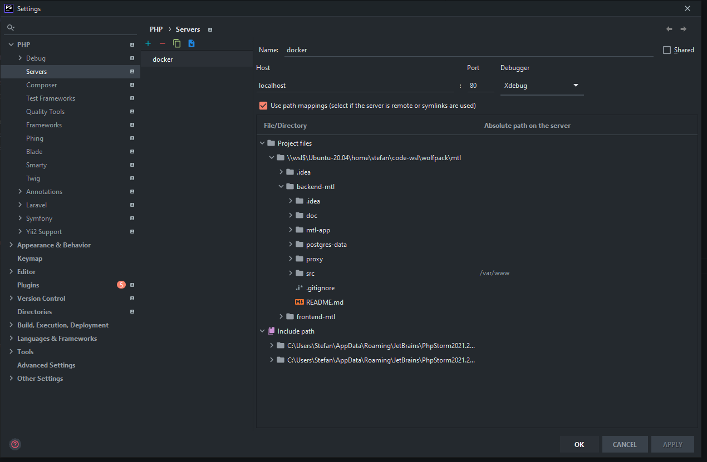
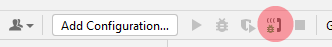

# Initial local setup

Welcome! If you're new to the team or you've received a new laptop, do the following to set up the system.

## Install the required software

* On Windows: [install WSL2](https://learn.microsoft.com/en-us/windows/wsl/install)
* On MacOS: [install Docker Desktop](https://www.docker.com/products/docker-desktop).

### Install Docker (Windows and WSL2 / Linux)

See https://docs.docker.com/engine/install/ubuntu/ for a detailed explanation on steps taken.

Execute the following:

```shell
curl -fsSL https://get.docker.com -o get-docker.sh
sudo sh get-docker.sh

sudo curl -L "https://github.com/docker/compose/releases/download/v2.15.1/docker-compose-$(uname -s)-$(uname -m)" -o /usr/local/bin/docker-compose
sudo chmod +x /usr/local/bin/docker-compose
```

## Clone the project

* Clone the repository in your projects folder
* Switch to the `main` branch

## Prepare the environment files

Since environment variables are secrets, we only ship example files called `.env.example` with the code. There are two
of these; one for the application, and another for the Docker container.

Copy the files and rename them to `.env` by executing the following commands in the root of the application:

`cp src/.env.example src/.env`  
`cp app/docker.env.example app/docker.env`

### Configuring .env files

Open `src/.env` in an editor and fill in the following fields:

```dotenv
# URL for the application ({PROJECT_ABBR}.test)
APP_URL=
# URL for the API (e.g. api.{PROJECT_ABBR}.test)
API_HOSTNAME=
```

### Configuring the hosts file

The URLs you've configured in your project need to be accessible by your browser. On live servers this is done by
setting the domain name to the correct server ip address. For your local environment to work, you need to tell your
machine that the traffic to the given domainname should be directed to your own machine. To do this, add the following
entries to your hosts file. (in case you have a different hostname compared to app.test, then change it accordingly)

On Windows, this file is located in `C:/Windows/System32/drivers/etc/hosts`. This file must be edited with administrator
privileges.

```hosts
- `127.0.0.1 app.test`
```

## Docker setup

### Create the network

Open a (bash) prompt in your projects folder and navigate to the root of this repository.

First, we need to create the Docker network and start up the reverse proxy.

Execute the following commands (Windows):

* `sudo docker network create nginx-proxy`
* `sudo docker-compose -f proxy/docker-compose.yml up -d`

### Build the Docker containers

To build, execute the following commands: (note, this step can take some time)

* `cd app`
* `sudo docker-compose --env-file ../src/.env up -d --build`

The application should now be available on the specified hostname.

## Application initialization

To get everything set up and ready, execute the following commands:

* `sudo docker exec {PROJECT_ABBR}-php composer install`
* `sudo docker exec {PROJECT_ABBR}-php php artisan key:generate`

## Optional

### Tinker

Tinker is a REPL which is [included in Laravel](https://laravel.com/docs/9.x/artisan) by default.

By default you might get an error (psysh) about a directory that's not set correctly.

To get Tinker to work, add the following to your `.env` file:

```dotenv
XDG_CONFIG_HOME=/tmp
```

### Database connection

The Postgres database is exposed to your host machine. You can connect to it using you favorite DB manager, with
host `postgres`, and the credentials that are present in the `src/.env` file.

### Mail testing

By default the local development environment uses [Mailhog](https://github.com/mailhog/MailHog) to send emails. The
mails are caught and can be viewed in your browser at http://localhost:8025 .

### PHP Debugging

Debugging your PHP code can be useful at some times. The docker configuration incorporates the ability to do that out of
the box. The only thing you need to do is to set the `XDEBUG_MODE` to `develop,debug` in `/app/docker.env`. Be sure
to restart the docker after making changes to the `/app/docker.env`.

When debugging is enabled, don't forget to configure your IDE to accept the incoming debugging connection.

Steps to take in PHPStorm:

- Go to settings (ctr+alt+s)
- Navigate to PHP -> Server
- Add a new one called 'docker' (this name needs to be identical to the `PHP_IDE_CONFIG` servername, which is defined in
  the `docker-compose` file under the php service.
- Select 'Use path mappings'
- Link the `src` folder to `/var/www`
- Save

Image  shows a complete overview of server.

To tell the docker service where the IDE is located on your windows machine, you need to save the ip in an environment
variable. Execute the following command in WSL:

- `printf "export XDEBUG_CLIENT_HOST=\$(awk \'/nameserver/ {print \$2}\' /etc/resolv.conf) \n" >> ~/.bashrc`
- `source ~/.bashrc`

This exports the ip address each time you login into WSL. Thus above commands are only need to be used once.

To listen to PHP Debug connections click on the small red phone in the top right corner.


See [Xdebug documentation](https://xdebug.org/docs/) for detailed information.
